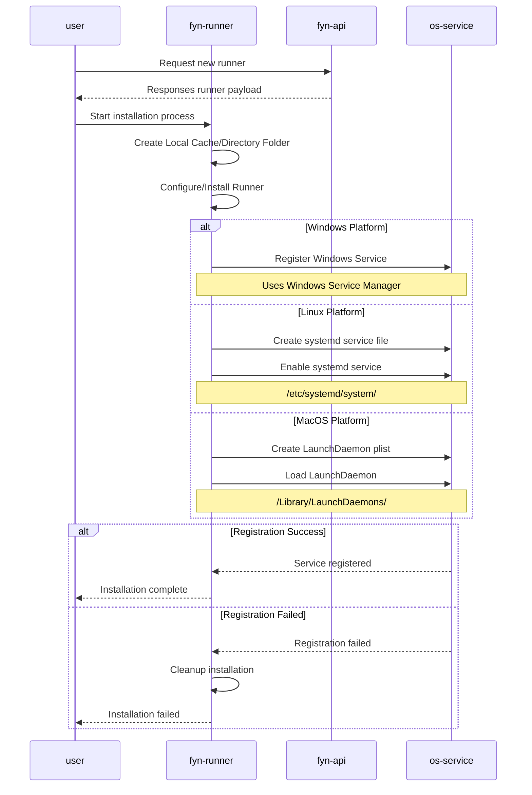
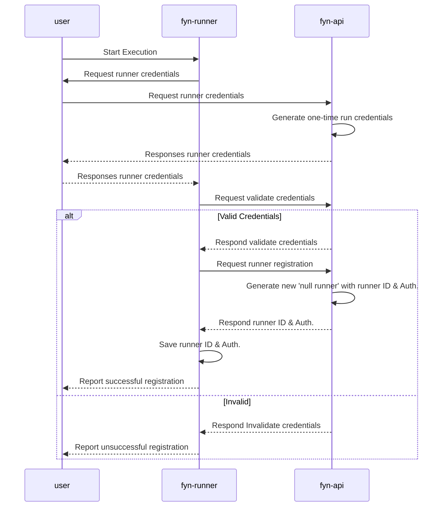
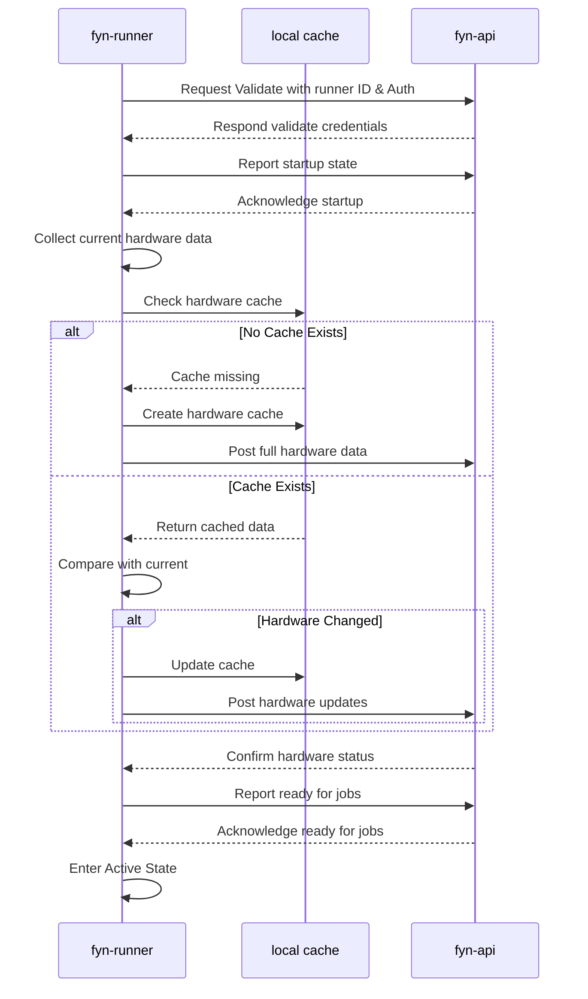
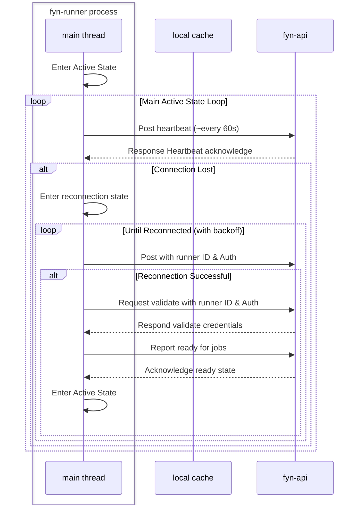

## Installation Process
- need to clean up end.

## Post-Installation Process

## Start up
- connecting to 'running' jobs left for later iteration.

## Active State Connection Events
- Once started we enter the main active state.
- We can accept jobs, and will launch new jobs threads when requested - (see Job events for event details.)
- Use web sockets
  

## Exit and Shutdown